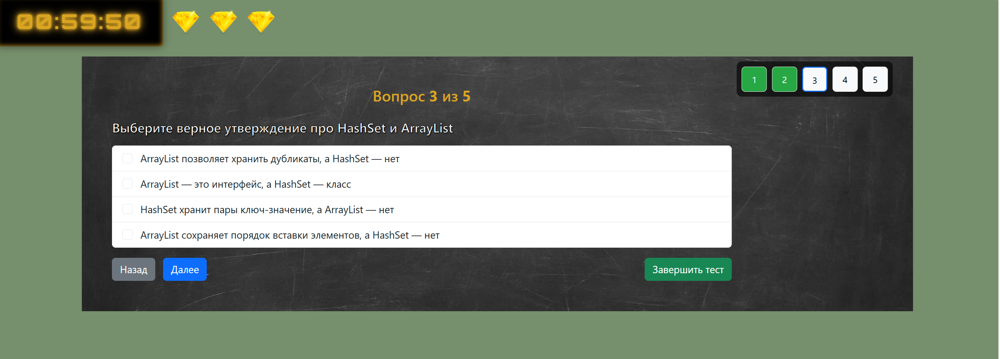
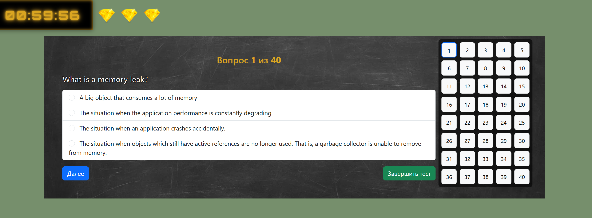

Quiz (Servlet/JSP)

Интерактивный учебный квиз: выбор команды и роли, подбор уровня сложности, прохождение тестов с ограничением по времени и «жизнями». 
Проект — стек Servlet/JSP/JSTL + H2 и Bootstrap 5. Есть Docker-сборка для быстрого запуска.

✨ Возможности

Выбор команды (4 дома), роли (Студент / Ментор) и уровня сложности (Простой / Сложный).

«Жизни» пользователя отображаются кристаллами; количество зависит от роли.

Лимит времени на квиз (по умолчанию 1 час).

Сохранение результатов в пределах сессии; повторное прохождение возможно с потерей жизни.

Список доступных тестов по языкам (русский, английский).

Адаптивный UI на Bootstrap 5, декоративные текстуры/аватары.

🧱 Технологии

Java 21, Servlet API, JSP + JSTL

H2 Database (file/embedded)

Maven

Tomcat 9

Docker (опционально)

Bootstrap 5, Google Fonts
